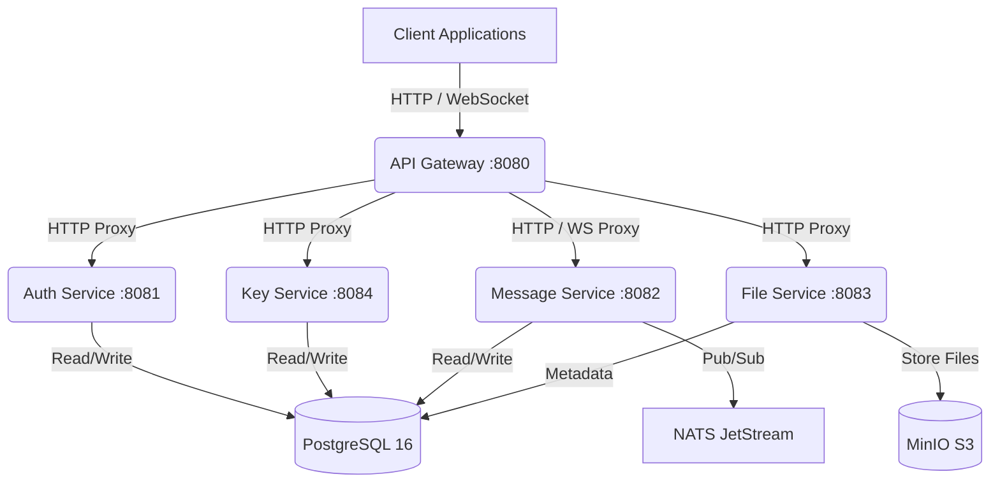

# Architecture Overview

The Secure Messenger is built using a microservices architecture to ensure scalability, maintainability, and clear separation of concerns. All microservices are written in Go and designed to be deployed using Docker.

## System Diagram

## Core Components

### API Gateway (`cmd/api-gateway`)
Acts as the single entry point for all client traffic.
- **Port:** 8080
- **Responsibilities:** Request routing, CORS handling, reverse proxying HTTP requests and WebSocket connections to corresponding backend microservices.

### Auth Service (`cmd/auth-service`)
Manages user identities and sessions.
- **Port:** 8081
- **Responsibilities:** User registration, login, token generation (JWT), and authentication validation.

### Key Service (`cmd/key-service`)
Handles public cryptographic keys necessary for the End-to-End Encryption (E2E) protocol.
- **Port:** 8084
- **Responsibilities:** Storing and retrieving Identity Keys, Signed PreKeys, and One-Time PreKeys used for the X3DH key agreement protocol.

### Message Service (`cmd/message-service`)
Handles real-time communication.
- **Port:** 8082
- **Responsibilities:** Managing group and individual conversations, saving encrypted messages, and routing real-time events via WebSockets. It uses NATS JetStream for pub/sub messaging across instances.

### File Service (`cmd/file-service`)
Handles the secure upload and download of encrypted media.
- **Port:** 8083
- **Responsibilities:** Storing file metadata in PostgreSQL and encrypted file blobs in MinIO (S3-compatible object storage).

## Infrastructure

- **PostgreSQL 16:** Primary relational database for user data, message history, keys, and metadata.
- **MinIO:** S3-compatible object storage for storing encrypted file objects.
- **NATS JetStream:** High-performance messaging system used for internal event distribution (e.g., cross-node real-time message delivery).
- **Redis:** Used for caching and rate limiting (if configured).

## Deployment
The ecosystem is containerized and orchestrated using Docker Compose for local development, with Kubernetes manifests provided for production deployment.
